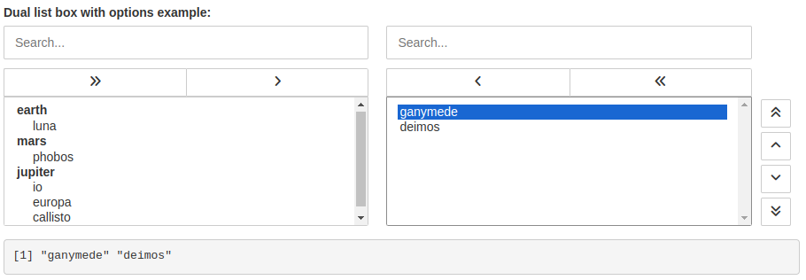
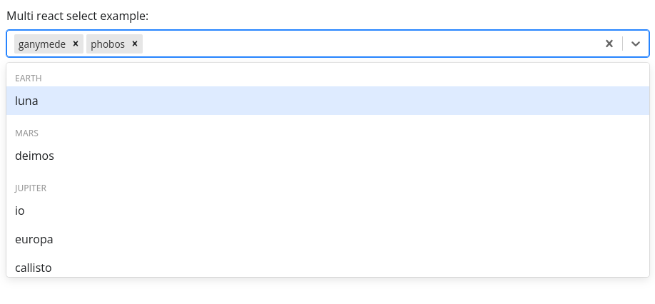

# reactwidgets

<!-- badges: start -->
[](https://lifecycle.r-lib.org/articles/stages.html#experimental)
<!-- badges: end -->

Extra widgets powered by React for Shiny applications.


## Installation

You can install the development version of reactwidgets from [GitHub](https://github.com/dreamRs/reactwidgets) with:

``` r
# install.packages("remotes")
remotes::install_github("dreamRs/reactwidgets")
```

## Dual Listbox

From [react-dual-listbox](https://jakezatecky.github.io/react-dual-listbox/)

```r
dualListBoxInput(
  "ID",
  label = "Dual list box with options example:",
  options = prepareDualListBoxOptions(list(
    earth = list("luna"),
    mars = c("phobos", "deimos"),
    jupiter = c("io", "europa", "ganymede", "callisto")
  )),
  canFilter = TRUE,
  showOrderButtons = TRUE,
  preserveSelectOrder = TRUE,
  alignActions = "top",
  width = "100%"
)
```




## Select

From [react-select](https://react-select.com/home)

```r
reactSelectInput(
  "ID2",
  label = "Multi react select example:",
  options = prepareReactSelectOptions(list(
    earth = list("luna"),
    mars = c("phobos", "deimos"),
    jupiter = c("io", "europa", "ganymede", "callisto")
  )),
  selected = "ganymede",
  placeholder = "Search for an option by typing",
  isMulti = TRUE,
  isSearchable = TRUE,
  width = "100%"
)
```



